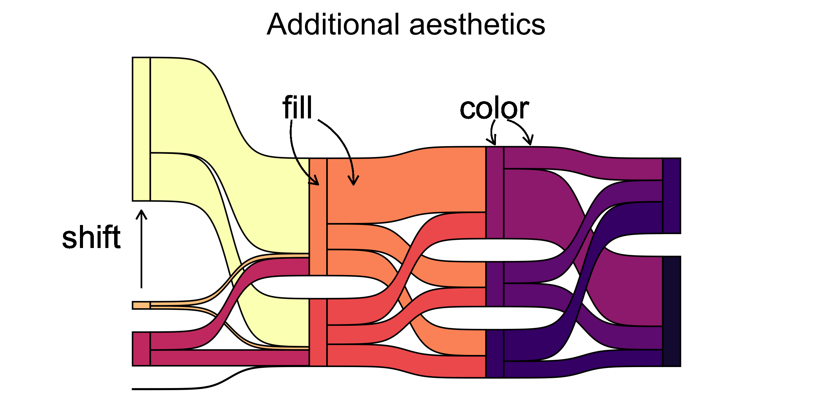
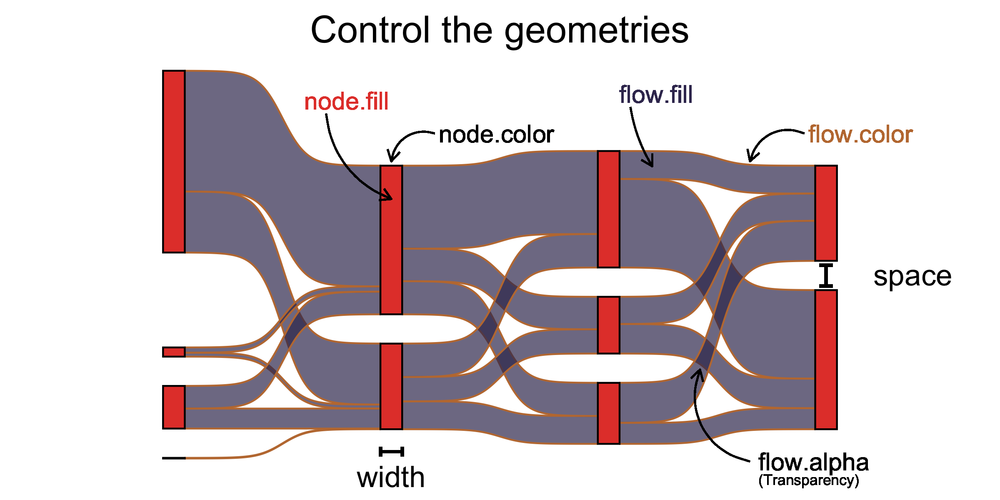
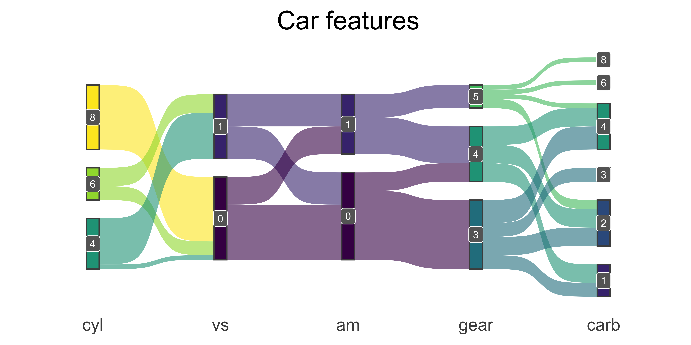
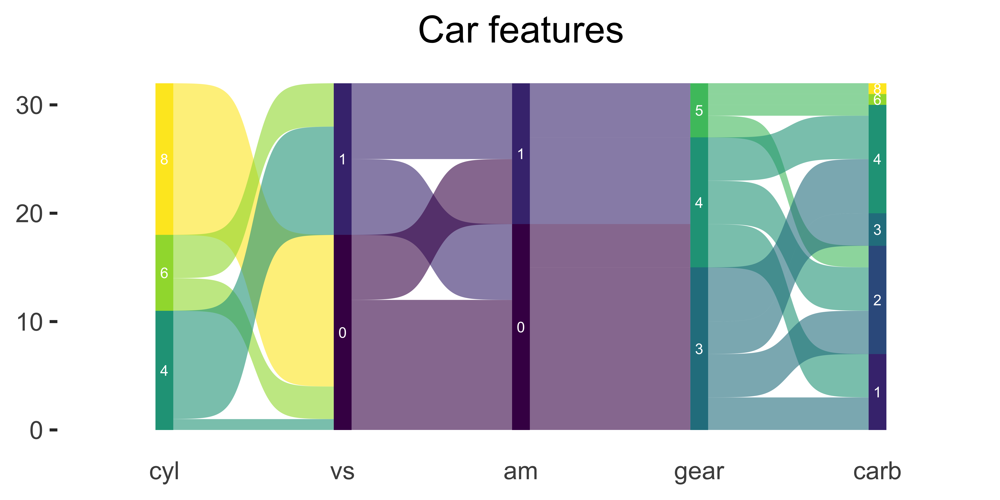
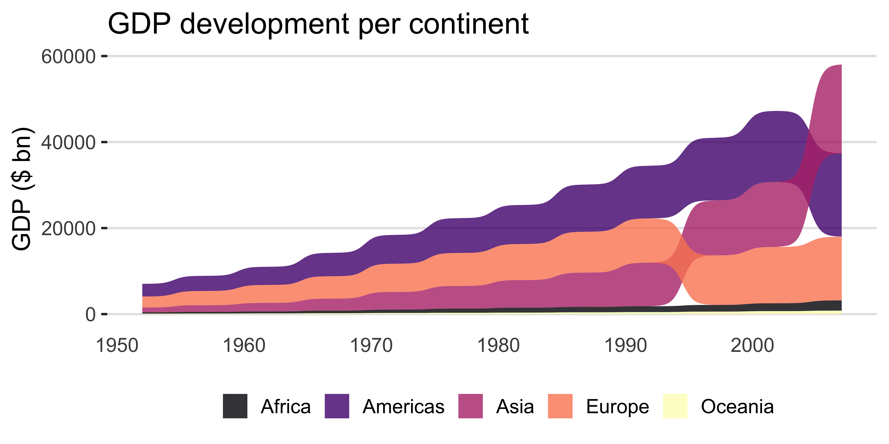

<!-- README.md is generated from README.Rmd. Please edit that file -->

# ggsankey

<!-- badges: start -->
<!-- badges: end -->

The goal of ggsankey is to make beautiful sankey, alluvial and sankey
bump plots in `ggplot2`

## Installation

You can install the development version of ggsankey from `github` with:

``` r
# install.packages("devtools")
devtools::install_github("davidsjoberg/ggsankey")
```

## How does it work

[Google](https://developers.google.com/chart/interactive/docs/gallery/sankey)
defines a sankey as:

***A sankey diagram is a visualization used to depict a flow from one
set of values to another. The things being connected are called nodes
and the connections are called links. Sankeys are best used when you
want to show a many-to-many mapping between two domains or multiple
paths through a set of stages.***

To plot a sankey diagram with `ggsankey` each observation has a *stage*
(called a discrete x-value in `ggplot`) and be part of a *node*.
Furthermore, each observation needs to have instructions of which *node*
it will belong to in the next *stage*. See the image below for some
clarification.


Hence, to use `geom_sankey` the aesthetics `x`, `next_x`, `node` and
`next_node` are required. The last *stage* should point to `NA`. The
aesthetics fill and color will affect both *nodes* and *flows*.

To plot a sankey diagram with `ggsankey` each observation has a *stage*
(called a discrete x-value in `ggplot`) and be part of a *node*.
Furthermore, each observation needs to have instructions of which *node*
it will belong to in the next *stage*. See the image below for some
clarification.



To control geometries (not changed by data) like fill, color, size,
alpha etc for *nodes* and *flows* you can either choose to set a global
value that affect both, or you can specify which one you want to alter.
For example `node.color = 'black'` will only draw a black line around
the nodes, but not the flows (links).



## Basic usage

### geom_sankey

A basic sankey plot that shows how dimensions are linked.

``` r
df <- mtcars %>%
  make_long(cyl, vs, am, gear, carb)

ggplot(df, aes(x = x, 
               next_x = next_x, 
               node = node, 
               next_node = next_node,
               fill = factor(node))) +
  geom_sankey() +
  scale_fill_discrete(drop=FALSE)
```


And by adding a little pimp.

- Labels with `geom_sankey_label` which places labels in the center of
  nodes if given the same aesthetics.
- `ggsankey` also comes with custom minimalistic themes that can be
  used. Here I use `theme_sankey`.

``` r
ggplot(df, aes(x = x, next_x = next_x, node = node, next_node = next_node, fill = factor(node), label = node)) +
  geom_sankey(flow.alpha = .6,
              node.color = "gray30") +
  geom_sankey_label(size = 3, color = "white", fill = "gray40") +
  scale_fill_viridis_d(drop = FALSE) +
  theme_sankey(base_size = 18) +
  labs(x = NULL) +
  theme(legend.position = "none",
        plot.title = element_text(hjust = .5)) +
  ggtitle("Car features")
```



### geom_alluvial

Alluvial plots are very similiar to sankey plots but have no spaces
between nodes and start at y = 0 instead being centered around the
x-axis.

``` r
ggplot(df, aes(x = x, next_x = next_x, node = node, next_node = next_node, fill = factor(node), label = node)) +
  geom_alluvial(flow.alpha = .6) +
  geom_alluvial_text(size = 3, color = "white") +
  scale_fill_viridis_d(drop = FALSE) +
  theme_alluvial(base_size = 18) +
  labs(x = NULL) +
  theme(legend.position = "none",
        plot.title = element_text(hjust = .5)) +
  ggtitle("Car features")
```



### geom_sankey_bump

Sankey bump plots is mix between bump plots and sankey and mostly useful
for time series. When a group becomes larger than another it bumps above
it.

``` r
df <- gapminder %>%
  group_by(continent, year) %>%
  summarise(gdp = (sum(pop * gdpPercap)/1e9) %>% round(0), .groups = "keep") %>%
  ungroup()

ggplot(df, aes(x = year,
               node = continent,
               fill = continent,
               value = gdp)) +
  geom_sankey_bump(space = 0, type = "alluvial", color = "transparent", smooth = 6) +
  scale_fill_viridis_d(option = "A", alpha = .8) +
  theme_sankey_bump(base_size = 16) +
  labs(x = NULL,
       y = "GDP ($ bn)",
       fill = NULL,
       color = NULL) +
  theme(legend.position = "bottom") +
  labs(title = "GDP development per continent")
```


